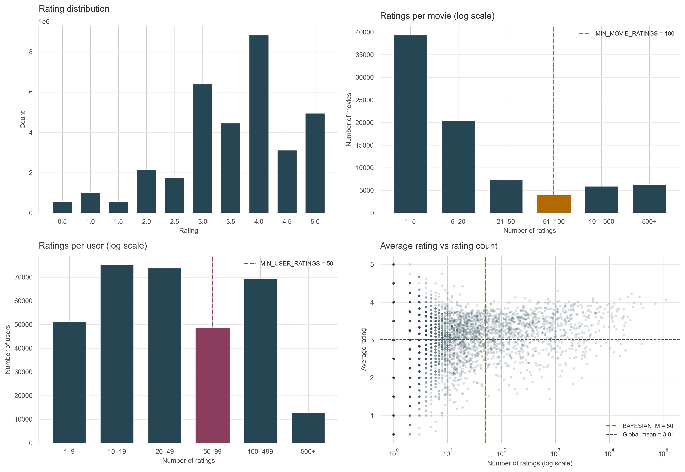

<h1 align="center">Movie Recommendation System</h1>

<em>Machine Learning — Lab 1</em>

---

## 1. Introduction

Online movie platforms provide access to very large catalogs of content, making it difficult for users to efficiently discover relevant items. Recommendation systems address this problem by automatically suggesting items that match user preferences and reduce information overload. 

However, movie recommendation remains challenging due to sparse rating data, cold-start issues for less popular items, and the difficulty of balancing accurate recommendations with broader discovery.

In this project, a movie recommendation system was implemented using the MovieLens dataset (Harper & Konstan, 2015). The system combines content-based filtering using TF-IDF representations of movie genres and tags with collaborative filtering based on matrix factorization. The final recommendations are generated using a hybrid scoring model.

## 2. Dataset & Exploratory Data Analysis

The MovieLens dataset consists of approximately 86,000 movies, 280,000 users and 33 million ratings. Four files were used in the analysis: movies, ratings, tags and links.

The figure below summarizes several distributional properties of the dataset that motivated preprocessing and modeling decisions.

  

<em>Figure 1. Overview of rating distributions and sparsity patterns in the MovieLens dataset.</em>

The rating distribution shows a clear selection bias, with higher ratings occurring more frequently than lower ratings and 4.0 being the most common value. 

The distributions of ratings per movie and ratings per user are highly skewed, indicating strong sparsity in the dataset. Most movies receive very few ratings and many users contribute only a small number of ratings. To reduce noise and improve model stability, minimum thresholds of 100 ratings per movie and 50 ratings per user were applied. 

The average rating versus rating count plot shows that movies with very few ratings exhibit extreme and unstable mean values. To address this issue, a Bayesian weighted rating was used to shrink movie ratings toward the global mean when the number of ratings is small, using a smoothing parameter $m = 50$

$$
WR = \frac{n}{n+m}R + \frac{m}{n+m}C
$$

where $R$ is the movie average rating, $n$ the number of ratings, $C$ the global mean rating, and $m$ the smoothing parameter set to 50.

## 3. Method

Several recommendation approaches were explored during development. A simple genre-based baseline was first implemented to establish a reference point, followed by a KNN model using binary genre vectors. Both approaches produced poor results — the baseline returned unrelated films and the KNN model was limited by the coarse granularity of genre labels. These limitations motivated the development of a hybrid model combining content-based and collaborative filtering.

Content-based filtering was implemented using TF-IDF vectorization of a content string constructed by concatenating each movie's genre labels and user-provided tags. Bigrams were included (`ngram_range = (1,2)`) to capture multi-word concepts such as *science fiction*, and sublinear term frequency scaling was applied to reduce the influence of frequently repeated terms. TF-IDF weighting was preferred over simple term frequency to give more weight to rarer, more discriminative terms. Movie similarity was computed using cosine similarity between TF-IDF vectors.

Collaborative filtering was implemented using Truncated SVD. A sparse user–item matrix was constructed and ratings were mean-centered per user prior to decomposition to remove individual rating bias. SVD factorizes the matrix into a lower-dimensional latent space where each movie is represented by a vector of latent factors. Movie similarity was then computed using cosine similarity between these vectors. Only users with at least 50 ratings and movies with at least 100 ratings were included in training, and the number of latent components was set to 100 after empirical evaluation.

To combine the strengths of both approaches, a hybrid scoring function was used. Each component score was normalized to $[0,1]$ using min–max scaling prior to combination, and a Bayesian weighted rating was included as a quality signal to prevent poorly rated movies from appearing among the top recommendations.

$$score = 0.40 \cdot s_{tfidf} + 0.40 \cdot s_{svd} + 0.20 \cdot s_{rating}$$

The Bayesian weighted rating was included as a quality signal to prevent poorly rated movies from appearing among the top recommendations despite high similarity scores. For movies not present in the SVD matrix, the collaborative filtering component was omitted and the remaining components combined proportionally. The weights were selected through empirical evaluation across several representative queries, including *Toy Story*, *Star Wars: Episode IV*, and *The Devil Wears Prada*.

The main hyperparameters used in the final model are summarized below.

| Parameter | Value | Motivation |
|---|---|---|
| `ngram_range` | (1,2) | Captures multi-word concepts such as *science fiction* |
| `max_features` | 50,000 | Limits vocabulary size and reduces noise |
| `n_components` | 100 | Balances representation capacity and overfitting |
| `min_user_ratings` | 50 | Ensures sufficient data per user for stable embeddings |
| `min_movie_ratings` | 100 | Ensures reliable item representations |
| `bayesian_m` | 50 | Smooths ratings toward the global mean for low-count movies |
| `tfidf_weight` | 0.40 | Content similarity contribution |
| `svd_weight` | 0.40 | Collaborative similarity contribution |
| `rating_weight` | 0.20 | Global quality signal |

## 4. Results

The recommender system was evaluated using both qualitative examples and quantitative metrics. The table below compares the behaviour of several recommendation approaches across representative queries.

| Query | Dummy baseline | KNN (genres) | TF-IDF | Hybrid |
|---|---|---|---|---|
| *Toy Story* | Unrelated films | *The Wild*, *Puss in Boots* | *Toy Story 2*, *Toy Story 3* | *Toy Story 2*, *Toy Story 3*, *A Bug's Life* |
| *Star Wars: Episode IV* | Unrelated films | *Logan's Run*, *Superman* | *Star Wars V*, *Star Wars VI* | *Star Wars V*, *Star Wars VI*, *Raiders of the Lost Ark* |
| *The Devil Wears Prada* | Unrelated films | *Angel in Cracow*, *Late Autumn* | *Julie & Julia*, *The Intern* | *Legally Blonde*, *Easy A*, *The Intern* |
*Qualitative comparison of recommendation approaches across representative movie queries.*

The hybrid recommender produced the most consistent and relevant recommendations across all queries. For *Toy Story*, the system returned closely related Pixar and animated family films. For *Star Wars: Episode IV*, the model identified both franchise sequels and related adventure films such as *Raiders of the Lost Ark*, reflecting shared audience preferences rather than only genre similarity. For *The Devil Wears Prada*, recommendations such as *Legally Blonde* and *Easy A* captured the tone and audience of the query film.

The collaborative filtering component was evaluated quantitatively using an 80/20 train–test split. The SVD model achieved a root mean squared error (RMSE) of 0.875 on the test set, indicating reasonable predictive accuracy given the sparsity of the rating matrix.

## 5. Discussion

The hybrid model demonstrated strong performance for well-known movies with sufficient rating and tag data, but several limitations were identified during evaluation.

The most prominent is the cold-start problem. Movies with few ratings or no user-provided tags rely entirely on genre labels for content representation, which is insufficient to distinguish between films within the same genre. This was observed for obscure titles, where recommendations often consisted of unrelated films sharing only broad genre categories. Closely related to this is the coverage limitation of the collaborative filtering component — only movies with at least 100 ratings were included in SVD training, restricting the matrix to approximately 12,000 of the 83,000 rated films. Less popular movies therefore fall back to TF-IDF-based recommendations, reducing the contribution of collaborative signals for a large portion of the catalogue.

A tendency to recommend franchise sequels was also observed. For well-known series such as *Star Wars*, top recommendations consisted predominantly of films from the same franchise. While this may reduce diversity, it reflects realistic user expectations — viewers searching for a film within a known series often expect related installments to appear. Commercial recommender systems typically address this through diversity-aware ranking strategies that balance similarity with broader discovery, a mechanism not implemented in the present system.

Finally, hyperparameter selection relied on empirical evaluation using a small set of representative queries. A more systematic approach would involve optimizing model weights using ranking-based metrics such as precision@k or recall@k on a held-out evaluation set.

---
## References

Harper, F. M., & Konstan, J. A. (2015).
The MovieLens Datasets: History and Context.
ACM Transactions on Interactive Intelligent Systems, 5(4), 19.
https://doi.org/10.1145/2827872

---
*This product uses the TMDB API but is not endorsed or certified by TMDB.*
